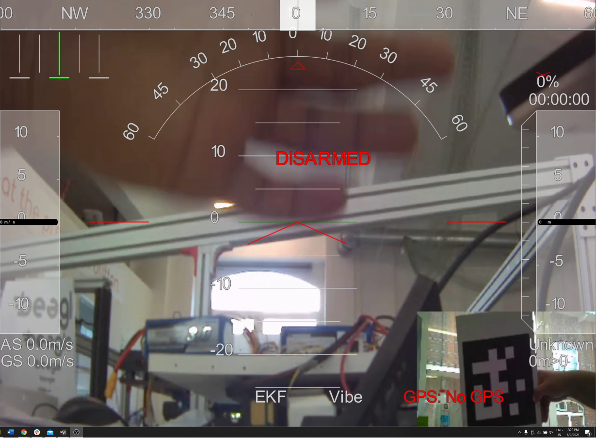

# Picture in Picture (PiP) Video stream output

**Plugins used** 
- Videomixer 
- Videobox 

*Note: No additional installation of plugins are required.*

**Resolution:**  
Stream 1: 640x480  
Stream 2: 198x144

## Preview of PiP (Screenshot)

