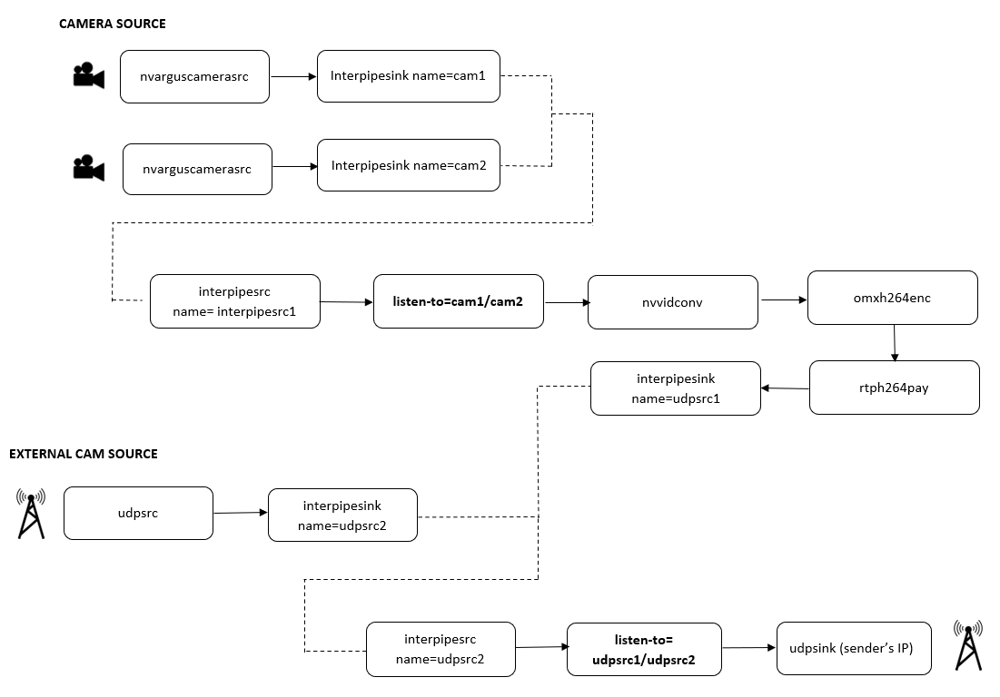

# Gstreamer guide for Switching Cameras 

## Introduction
This pipeline is developed to allow easy switching between any two cameras from the source, in our the drone. The general scenario in our case will be switching between front facing cameras and down facing cameras, to monitor drone via GCS. In special cases, front facing cameras can be replaced by a seeker camera depending on aircraft variant. 

A special clause or requirement that was fulfilled during developement was to switch between external camera source. This is shown in the below overall architecture, where the stream can be switched between external camera source and camera source from the drone. 

Using this particular pipeline will allow us to change different channel's of stream at source level and only one channel of stream is sent to client PC. This will allow us to save bandwidth, which is a potential constraint during our operations. 


## Overall Architecture



## Express Installer Guide

Run the below scripts to install all the necessary dependencies for Gstinterpipe and also includes setting up services to run all the pipelines automatically. 

```
git clone https://github.com/BeagleSystems/GstreamerPipelineFactory.git
cd GstreamerPipelineFactory/gstinterpipe_toggle_camera/deploy/
chmod +x gstinterpipe_installer.sh
sudo sh ./gstinterpipe_installer.sh
```

*The installation process might take a while, (Around 5-10mins)*

Setting up services,

```
cd GstreamerPipelineFactory/gstinterpipe_toggle_camera/deploy/
chmod +x install_switch_services.sh
sudo sh ./install_switch_services.sh
```

## Installation guide (Manual)

Since Gstreamer Gstinterpipe isn't available in default libraries from Gstreamer. It is requested to setup the source PC(Jetson Nano) with additional packages in order to run Gstinterpipe pipelines.  

### 1. Installing Gstreamer Daemon


**Step 1: Clone the latest version repository** 

```
git clone https://github.com/RidgeRun/gstd-1.x.git
```

**Step 2: Install Dependencies**

```
sudo apt-get install automake libtool pkg-config libgstreamer1.0-dev libgstreamer-plugins-base1.0-dev libglib2.0-dev libjson-glib-dev gtk-doc-tools libreadline-dev libncursesw5-dev libdaemon-dev libjansson-dev libsoup2.4-dev python3-pip
```

**Step 3: Build**

 ```
 ./autogen.sh
 ./configure 
 make
 ```

**Step 4: Install the Binaries**

 ```
 make install 
 ```

**Step 5: Check**
 
 ```
 gstd 
 ```
 


### 2. Installing GstInterpipe
 
**Step 1: Clone the latest version repository**

```
git clone https://github.com/RidgeRun/gst-interpipe.git
```

**Step 2: Install Dependencies**
```
sudo apt-get install libgstreamer1.0-dev libgstreamer-plugins-base1.0-dev gtk-doc-tools
```

**Step 3: Build the project**

 ```
 ./autogen.sh --libdir /usr/lib/aarch64-linux-gnu/
 make
 make check
 sudo make install
 ```

**Step 4: Verify plug-in Installed** 

 ```
 gst-inspect-1.0 interpipe
 
 Plugin Details:
   Name                     interpipe
   Description              Elements to communicate buffers across pipelines
   Filename                 /usr/lib/x86_64-linux-gnu/gstreamer-1.0/gstreamer-1.0/libgstinterpipe.so
   Version                  1.0.2
   License                  Proprietary
   Source module            gst-interpipe
   Binary package           GstInterpipe
   Origin URL               http://www.ridgerun.com

   interpipesrc: Inter pipeline source
   interpipesink: Internal pipeline sink

```

## Initializing the Pipelines

**Step 1: Open a new terminal and run launch GST Daemon** 
 
 ```
 gstd 
 ```

**Step 2: Create CAM0 pipeline (Example pipeline is for CSI Camera)**
 
 ```
gst-client pipeline_create pipe1 nvarguscamerasrc sensor_id=0 ! \
'video/x-raw(memory:NVMM), format=NV12, width=1280, height=720, framerate=59/1' !\
interpipesink name=cam1 async=true sync=false 
 ```
**Step 3: Create CAM1 pipeline (Example pipeline is for CSI Camera)**
 
 ```
gst-client pipeline_create pipe2 nvarguscamerasrc sensor_id=1 ! \
'video/x-raw(memory:NVMM), format=NV12, width=1280, height=720, framerate=59/1' !\
 interpipesink name=cam2 async=true sync=false
 ```
**Step 4: To create sink and RTSP output from source**

 ```
gst-client pipeline_create pipe3 interpipesrc name=interpipesrc1 listen-to=cam1 format=time ! \
queue ! nvvidconv ! 'video/x-raw,format=NV12, width=640, height=480, framerate=59/1' ! \
omxh264enc profile=8 control_rate=2 insert-sps-pps=1 iframeinterval=15 bitrate=1000000 ! \
'video/x-h264,stream-format=avc' ! rtph264pay ! 'application/x-rtp, payload=96' !  interpipesink name=udpsrc1
 ```

*The below steps should be created only in the case of existance of an external camera source.*

**Step 5: (Optional) To recieve stream from external camera source**

 ```
 gst-client pipeline_create pipe4 udpsrc address=192.168.2.52 port=8554 ! interpipesink name=udpsrc2
 ```
**Step 6: (Optional) To create sink and RTSP output, during external camera source switch setup**
 ```
gst-client pipeline_create pipe5 interpipesrc name=udpsink1 listen-to=udpsrc1 ! 'application/x-rtp, payload=96' ! \
udpsink host=192.168.2.95 port=8554 sync=false async=false
 ```

**Step 7: Start the pipeline**

Usually with the case of Gstreamer, the pipeline is created and initalized at the same time. In case GStreamer interpipe, the pipeline needs to be initalized seperatly. A set of commands come in handy to start, stop and delete the pipeline (as shown below).

To start a pipline 
 ```
 gst-client pipeline_play <pipeline_name>
 ```
To stop a pipline 
 ```
 gst-client pipeline_stop <pipeline_name>
 ```
To delete a pipeline
 ```
 gst-client pipeline_delete <pipeline_name>
 ```

 In our case <pipeline_name> are named as PipeX, where X=1,2....5


 ## Switching between Camera Sources

**1. To switch Host (Drone) Camera's**

 ```
gstd-client element_set pipe3 interpipesrc1 listen-to cam1
 ```
Where, <br />
cam1 - Camera source 1 (CSI Camera) <br /> 
cam2 - Camera source 2 (CSI Camera)

**2. To Switch between UDPSRC source's**
 ```
gstd-client element_set pipe5 udpsink1 listen-to udpsrc2
 ```

Where, <br />
udpsrc1 - Host camera source <br />
udpsrc2 - External camera source
